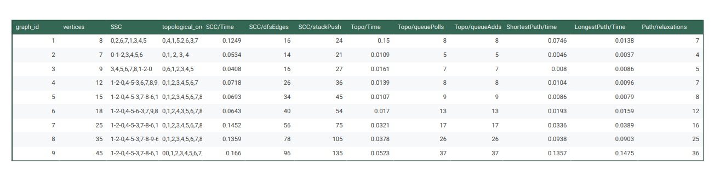

# Report for Assignment 4

In this assignment i implemented algorithms:
- **Kosaraju’s Algorithm** for Strongly Connected Components (SCC)
- **Kahn’s Algorithm** for Topological Ordering
- **Shortest/Longest Path algorithms in a Directed Acyclic Graph (DAG)** using **edge weights**

## My project Structure
- **graph package** contains all the algorithms + wrapper class AlgorithmResult to construct
  output
- **data** contains input.json file with 9 datasets (about them later)
- **GraphUtils** contains utils for Graph, like Graph itself, Edge and GraphList
- **IOHandler** InputReader and OutputWriter that work with json files
- **TableResults** with output results in csv and table format
- **GraphResult** is helper to construct output
- **Metrics** to track the perfromance of algorithms
- **Main** runs OutputWriter that does all the job(reding input through InputReader,
  running algorithms, tracking metrics and recording results)

## Input Datasets
In **data** package there is **input.json** that contains 9 graphs:
- 3 small graphs: 8,7,9 nodes.
    - 1 graph is pure DAG, no SCC
    - 2 has one cycle
    - 3 has one cycle and one DAG
- 3 medium graphs: 12,15,18 nodes
    - 1 has two SCC
    - 2 has three SCC
    - 3 has two SCC
- 3 large graphs: 25,35,45 nodes
    - 1 is dense graph with 4 SSCs
    - 2 has SCCs and DAG
    - 3 has 4 SCCs and longest DAG

## Algorithms
### Kosaraju's Algorithm for finding SCC in a directed graph
Steps:
- Perform DFS on the original graph and push vertices to a stack
- After DFS on original graph, reverse all edges to get the transposed graph
- Pop vertices from the stack and perform DFS on the transposed graph to collect components.
  so each DFS Tree in the second pass corresponds to one SCC.

Execution metrics showed that DFS visit counts grow linearly with the number of vertices and edges,
confirming expected **O(V + E) complexity**.

### Kahn's Algorithm for Topological Ordering
Steps:
- Count how many incoming edges each vertex has.
- Put all vertices with 0 incoming edges into a queue
- While the queue isn’t empty, take a vertex out, add it to the order,
  and reduce the incoming edge count of its neighbors.

The time complexity is **O(V+E)** as well, and metrics proved the correctness of it

### Shortest/Longest Paths in DAG
After computing a valid topological order, i computed shortest and longest paths
Steps for Shortest Algorithm:
- Initialize all distances as very large number (infinity) except for the source.
- Process vertices in topological order, relaxing outgoing edges (choosing smaller paths)
- Record parent arrays for path reconstruction

Longest Paths Algorithm works similarly, except it initializes distances as very small numbers and when relaxing, it
takes the larger edge instead.  
Relaxation counts matched the number of edges, confirming O(V + E) time complexity.
On the largest dataset, execution time remained below 0.15 ms, showing great performance.
## Metrics
I tracked these metrics: execution Time;stackPush, dfsVisits and dfsEdges for SCC,
queueAdds and queuePolls for topological order; relaxations for shortest/longest paths.   

## Tests
All the algorithms were tested, and passed all the tests on small deterministic cases + edge cases.
### SCCTest.
i tested Kosaraju's algorithm with: simpleSCC, Single node graph, disconnected graph, fully connected graph, empty graph.
### Topological Order
I tested Kahn's algorithm with: simpleDAG, single node graph, disconnected DAG, cyclic graph, empty graph
### Shortest/Longest PAths on DAG
I tested Shortest path and longest path separately on trivial graph, and for each tested the reconstruction, then i tested them both with:
single node graph, disconnected graph, empty graph.

**All the algorithms passed the tests**
## The SCCs and Topological Orders for each graph from input.json
1) SCC = 0,2,6,7,1,3,4,5, Topo = 0,4,1,5,2,6,3,7
2) SCC = 0-1-2, 3, 4, 5, 6. Topo = 0,1, 2, 3, 4
3) SCC = 3,4,5,6,7,8, 1-2-0. Topo = 0,6,1,2,3,4,5
4) SCC = 1-2-0, 4-5-3, 6,7,8,9,10. Topo = 0,1,2,3,4,5,6,7
5) SCC = 1-2-0, 4-5-3, 7-8-6, 10,11,12,13,14. Topo = 0,1,2,3,4,5,6,7,8
6) SCC = 1-2-0, 4-5-6-3, 7,9,8,10,11,12,13,15,17,14,16. Topo = 0,1,2,4,3,5,6,7,8,11,9,12,10
7) SCC = 1-2-0, 4-5-3, 7-8-6, 10-11-9, 12,13,14,15,16,17,18,19,20,21,22,23,24. Topo = 0,1,2,3,4,5,6,7,8,9,10,11,12,13,14,15,16
8) SCC = 1-2-0, 4-5-3, 7-8-9-6, 11-12-10, 13,14,15,16,17,18,19,20,21,22,23,25,24,26,27,28,29,30,31,32,33,34.  
   Topo = 0,1,2,3,4,5,6,7,8,9,10,11,12,13,14,16,15,17,18,19,20,21,22,23,24,25
9) SCC = 1-2-0,4-5-3,7-8-6,10-11-9,12,13,14,15,16,17,18,19,20,21,22,23,24,25,26,27,28,29,30,31,32,33,34,35,36,37,38,39,40,41,42,43,44.
   Topo=00,1,2,3,4,5,6,7,8,9,10,11,12,13,14,15,16,17,18,19,20,21,22,23,24,25,26,27,28,29,30,31,32,33,34,35,36

## Analysis (based on output.json)
### SCC
- The SCC algorithm correctly grouped nodes into strongly connected sets.
- For smaller graphs the execution time stayed around 0.04–0.07 ms
- For larger graphs the time increased gradually to about 0.16 ms, showing a smooth and expected growth with input size.
- The number of DFS visits and stack pushes also grew linearly with graph size, confirming consistent depth-first search behavior.
- This proves that the algorithm runs efficiently and scales well for larger DAGs.
### Topological Order
- Kahn’s algorithm produced valid topological orders in all 9 cases.
- The number of queue operations matched the number of vertices, confirming that each node was processed exactly once.
- Execution time grew slightly with input size, which is expected since it runs in O(V +E) time
- Overall, the algorithm showed good and predictable performance.
### Shortest and Longest Path in DAG
- Both shortest and longest path algorithms produced identical distance patterns when edge weights were equal
- The distance values increased consistently from the source vertex, confirming the correctness of path relaxation.
- Execution times were low, from 0.004ms on small graphs to around 0.13 ms on the largest
- The number of relaxations matched the number of edges, proving that every connection was processed exactly once.
- So the performace grew linearly with input size, confirming good scalability and O(V+E) complexity

## Bottlenecks and Structural Effects

### SCC :
The main bottleneck is performing two full DFS traversals. Denser graphs increased DFS visits and stack operations proportionally. Graphs with large SCCs took 
more runtime, but overall growth remained linear.

### Topological Sort:
The bottleneck is updating in-degree counts and queue operations. Denser graphs caused more in-degree updates, but each vertex and edge was processed once, so performance grew linearly anyway.

### Shortest/Longest Paths:
The main cost was because of  edge relaxations. In dense DAGs, relaxations increased since every vertex had many outgoing edges. But because each edge is only processed once, runtime still O(V+E).
Graphs with longer chains of nodes (deeper topological order) took slightly more time, but nothing major.

## Conclusion
All algorithms showed linear growth in metrics, which matches with their theoretical time complexities O(V+E).There were no incorrect results in any dataset.
The consistency between shortest and longest path outputs (when weights were equal) also confirms correctness of path traversal and topological order.